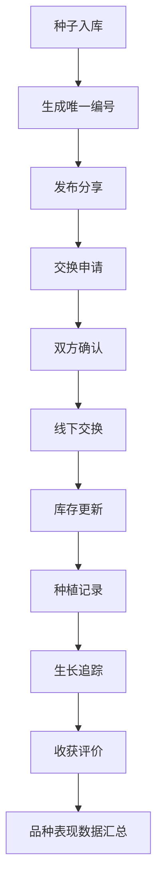

## 1. 产品概述

社区种子银行与老品种保育交换平台，致力于解决社区种子银行对本地老品种种子的保育登记、交换与种植追踪问题。平台为管理员和种植者提供种子全生命周期管理，支持种子录入、交换、种植记录与数据统计分析，推动老品种种子的保护与传承。

- **核心价值**：建立老品种种子的数字化保育体系，促进社区内种子交换与种植经验分享
- **目标用户**：种子银行管理员、社区种植者、老品种爱好者
- **市场定位**：专注于本地老品种保育的社区化平台

## 2. 核心功能

### 2.1 用户角色

| 角色 | 注册方式 | 核心权限 |
|------|----------|----------|
| 管理员 | 系统预设 | 种子录入审核、数据统计、用户管理 |
| 种植者 | 自主注册 | 种子录入、发布分享、交换申请、种植记录 |

### 2.2 功能模块

1. **数据看板**：种子库存概览、交换统计、活跃用户、濒危品种标记
2. **种子管理**：种子列表、详情查看、种子录入、分类筛选
3. **种子交换**：分享发布、交换申请、交换确认、谱系追溯
4. **种植追踪**：种植记录、生长日志、收获评价、异地种植表现
5. **统计分析**：物种分布、年度趋势、贡献排行、品种热度

### 2.3 页面详情

| 页面名称 | 模块名称 | 功能描述 |
|----------|----------|----------|
| 数据看板 | 指标卡片 | 在库品种数、本月交换次数、活跃种植者数、濒危品种数 |
| 数据看板 | 物种分布饼图 | 按物种分类展示种子数量占比 |
| 数据看板 | 年度趋势柱状图 | 按年份统计入库量与交换量趋势 |
| 种子列表 | 筛选区 | 物种分类、品种类型、种植季节筛选 |
| 种子列表 | 种子卡片 | 展示种子照片、名称、分类、数量、发芽率 |
| 种子详情 | 基本信息 | 品种名称、分类、类型、年份、来源、储存条件 |
| 种子详情 | 特性描述 | 抗病性、口感、产量、适应性、历史故事 |
| 种子详情 | 照片展示 | 种子与植株照片轮播 |
| 种子详情 | 流转历史 | 从入馆到历次交换的完整谱系追溯链 |
| 种子录入 | 表单 | 完整的种子信息录入表单，支持照片上传 |
| 交换大厅 | 分享列表 | 可分享种子列表，标注分享条件 |
| 交换大厅 | 交换申请 | 提交交换申请，填写种植计划 |
| 交换管理 | 我的分享 | 管理发布的分享，确认交换申请 |
| 交换管理 | 我的申请 | 查看交换申请状态 |
| 种植记录 | 记录列表 | 我的种植记录列表 |
| 种植记录 | 记录详情 | 种植日期、方式、生长周期、病虫害、收获、评价 |
| 种植记录 | 新增记录 | 录入种植信息与收获评价 |
| 统计分析 | 物种分布 | 各物种分类种子数量统计 |
| 统计分析 | 老品种统计 | 老品种数量、三年以上未更新濒危品种标记 |
| 统计分析 | 贡献排行 | 按种植者统计贡献排行 |
| 统计分析 | 品种热度 | 各品种交换热度及种植反馈评分 |

## 3. 核心流程

### 3.1 种子录入流程
管理员或种植者填写种子信息表单 → 上传种子与植株照片 → 系统生成唯一编号 → 种子入库

### 3.2 种子交换流程
种植者发布可分享种子 → 需求者筛选浏览提交交换申请 → 双方确认线下交换 → 系统记录交换信息并更新库存 → 流转历史更新

### 3.3 种植追踪流程
获得种子的种植者创建种植记录 → 记录生长阶段与病虫害情况 → 收获后上传照片并评价 → 数据关联回原种子批次

## 4. 用户界面设计

### 4.1 设计风格
- **主色调**：森林绿 (#2d5a27)，象征自然与生机
- **辅助色**：琥珀金 (#c9a227)，象征丰收与珍贵
- **背景色**：米白 (#faf8f3)，营造温暖自然的氛围
- **按钮风格**：圆角矩形，柔和阴影，悬停微放大效果
- **字体**：标题使用衬线字体，正文使用易读的无衬线字体
- **布局风格**：卡片式布局，层次分明，大量留白
- **图标风格**：线性图标，自然元素主题（叶子、种子、花朵）

### 4.2 页面设计概述

| 页面名称 | 模块名称 | UI元素 |
|----------|----------|--------|
| 数据看板 | 指标卡片 | 渐变背景、图标动画、数字跳动效果 |
| 数据看板 | 图表区域 | 柔和配色、交互式图表、悬停提示 |
| 种子列表 | 种子卡片 | 图片圆角、悬浮阴影、标签徽章 |
| 种子详情 | 信息区 | 分段式布局、时间线流转历史 |
| 表单页面 | 表单 | 分组字段、图标引导、柔和边框 |

### 4.3 响应式
- 桌面端优先设计，适配平板和移动端
- 侧边栏在移动端转为底部导航或汉堡菜单
- 卡片网格自适应列数
- 触控区域优化，确保移动端操作体验

### 4.4 动效设计
- 页面加载时元素渐入动画
- 卡片悬停时轻微上浮与阴影加深
- 数据看板数字滚动动画
- 表单字段聚焦时边框高亮过渡
- 标签切换时内容淡入淡出
