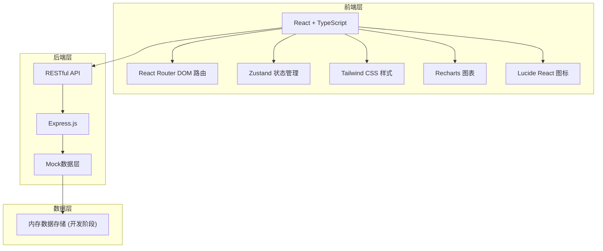
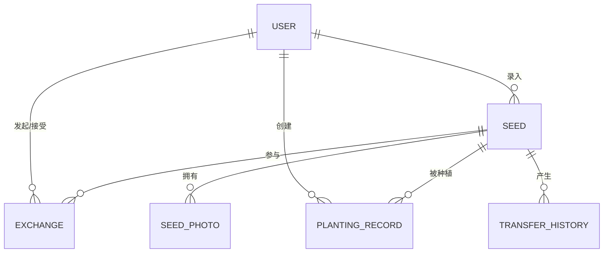

## 1. 架构设计



## 2. 技术描述

- **前端框架**: React@18 + TypeScript
- **构建工具**: Vite
- **路由管理**: react-router-dom@6
- **状态管理**: zustand
- **样式方案**: Tailwind CSS@3
- **图表库**: recharts
- **图标库**: lucide-react
- **后端框架**: Express@4
- **数据存储**: 内存Mock数据（开发阶段）

## 3. 路由定义

| 路由 | 页面 | 说明 |
|------|------|------|
| / | 数据看板 | 首页，展示统计概览 |
| /seeds | 种子列表 | 所有种子的列表展示与筛选 |
| /seeds/:id | 种子详情 | 单份种子的详细信息 |
| /seeds/new | 种子录入 | 新增种子录入表单 |
| /exchange | 交换大厅 | 可分享种子列表 |
| /exchange/my | 我的交换 | 我的分享与申请管理 |
| /planting | 种植记录 | 我的种植记录列表 |
| /planting/new | 新增种植记录 | 新建种植记录 |
| /planting/:id | 种植记录详情 | 单条种植记录详情 |
| /statistics | 统计分析 | 详细统计报表 |

## 4. 数据模型

### 4.1 实体关系图



### 4.2 数据类型定义

```typescript
// 用户
interface User {
  id: string;
  name: string;
  avatar: string;
  role: 'admin' | 'grower';
  joinDate: string;
  contributedSeeds: number;
}

// 种子
interface Seed {
  id: string;
  code: string; // 唯一编号
  name: string; // 品种名称
  species: 'vegetable' | 'grain' | 'bean' | 'melon' | 'spice' | 'flower' | 'herb'; // 物种分类
  varietyType: 'heirloom' | 'hybrid' | 'local' | 'wild'; // 品种类型
  collectYear: number; // 采集/入馆年份
  source: 'self' | 'neighbor' | 'wild' | 'bank'; // 来源
  quantity: number; // 数量(克)
  germinationRate: number; // 发芽率(%)
  storageCondition: 'normal' | 'cold' | 'frozen' | 'dry' | 'dark'; // 储存条件
  photos: SeedPhoto[];
  diseaseResistance: string;
  taste: string;
  yield: string;
  adaptability: string;
  history: string; // 历史故事
  ownerId: string;
  createdAt: string;
  isEndangered?: boolean; // 是否濒危
  lastUpdateDate: string;
}

// 种子照片
interface SeedPhoto {
  id: string;
  url: string;
  type: 'seed' | 'plant' | 'fruit';
  description?: string;
}

// 流转历史
interface TransferHistory {
  id: string;
  seedId: string;
  type: 'entry' | 'exchange_out' | 'exchange_in' | 'planting';
  fromUserId?: string;
  toUserId?: string;
  date: string;
  quantity: number;
  note?: string;
}

// 交换分享
interface Exchange {
  id: string;
  seedId: string;
  sharerId: string;
  quantity: number;
  condition: 'free' | 'exchange' | 'return' | 'community_only'; // 分享条件
  description: string;
  status: 'active' | 'exchanged' | 'closed';
  createdAt: string;
}

// 交换申请
interface ExchangeRequest {
  id: string;
  exchangeId: string;
  seedId: string;
  requesterId: string;
  plan: string; // 种植计划
  status: 'pending' | 'approved' | 'rejected' | 'completed';
  requestDate: string;
  exchangeDate?: string;
}

// 种植记录
interface PlantingRecord {
  id: string;
  seedId: string;
  userId: string;
  seedBatchCode: string;
  plantDate: string;
  location: string; // 文字地块位置
  method: 'direct' | 'seedling' | 'transplant' | 'pot'; // 种植方式
  germinationDate?: string;
  floweringDate?: string;
  fruitingDate?: string;
  pestDisease: string; // 病虫害与处理
  harvestDate?: string;
  harvestYield?: number; // 产量(克)
  tasteRating: number;
  yieldRating: number;
  diseaseRating: number;
  adaptabilityRating: number;
  overallRating: number;
  review: string; // 种植体验评价
  photos: string[];
  createdAt: string;
}
```

## 5. 项目结构

```
├── src/
│   ├── components/      # 公共组件
│   │   ├── Layout.tsx   # 布局组件
│   │   ├── SeedCard.tsx # 种子卡片
│   │   └── ...
│   ├── pages/           # 页面组件
│   │   ├── Dashboard/   # 数据看板
│   │   ├── Seeds/       # 种子管理
│   │   ├── Exchange/    # 种子交换
│   │   ├── Planting/    # 种植记录
│   │   └── Statistics/  # 统计分析
│   ├── store/           # Zustand状态管理
│   ├── utils/           # 工具函数
│   ├── types/           # TypeScript类型定义
│   ├── data/            # Mock数据
│   └── App.tsx
├── api/                 # Express后端
│   ├── routes/
│   └── index.ts
├── shared/              # 共享类型
└── ...配置文件
```

## 6. 设计系统

### 6.1 颜色系统
- 主色: `#2d5a27` (森林绿)
- 辅助色: `#c9a227` (琥珀金)
- 背景色: `#faf8f3` (米白)
- 文字色: `#2c2c2c` (深灰)
- 浅色文字: `#6b7280` (中灰)

### 6.2 间距系统
- 基础单位: 4px
- 常用间距: 8px, 16px, 24px, 32px, 48px

### 6.3 字体系统
- 标题: 衬线字体 (Lora/Noto Serif SC)
- 正文: 无衬线字体 (系统字体)
- 字号层级: 12px, 14px, 16px, 18px, 24px, 32px
